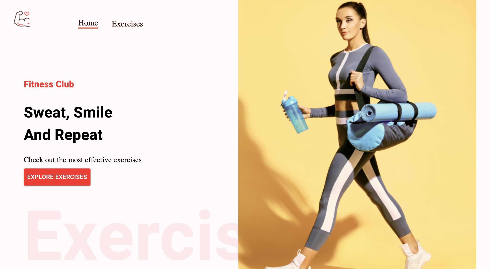

<h1 align="center">Slim</h1>

 

  

## Project

An exercise and fitness based app developed using React. Data was obtained using APIs from RapidAPI.

## Technologies Used

* [ReactJS](https://reactjs.org/)
* [Typescript](https://www.typescriptlang.org/)
* [Material UI](https://mui.com/material-ui/getting-started/overview/)

## License

This project is licensed under the MIT License - see the [LICENSE.md](https://github.com/GabrielCS0/slim/blob/main/LICENSE) file for details.